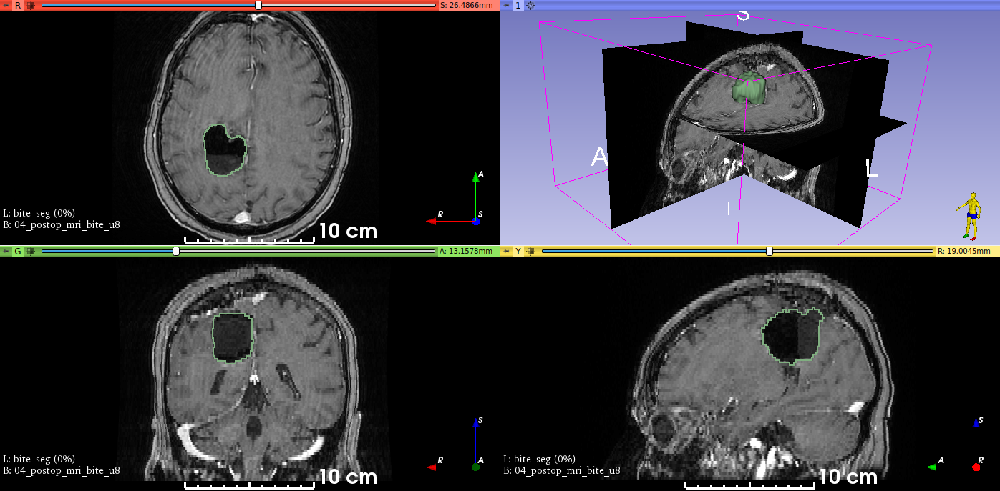
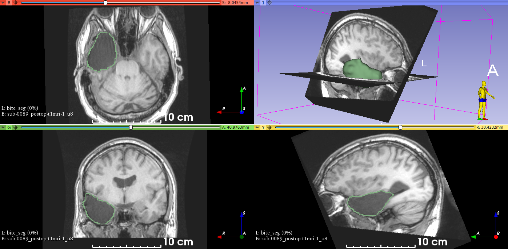
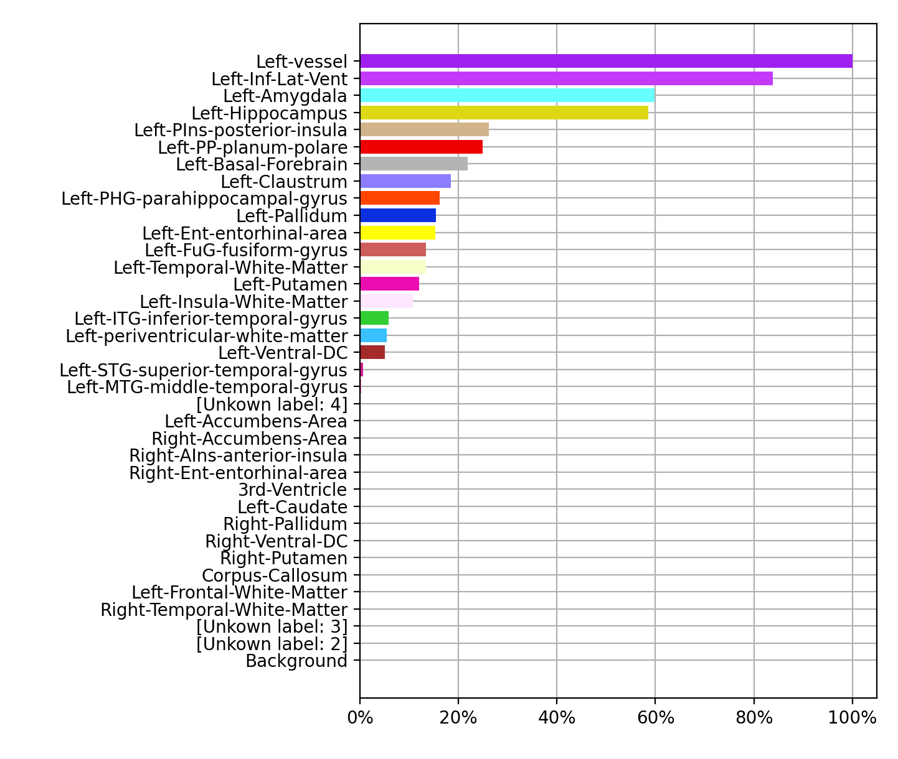
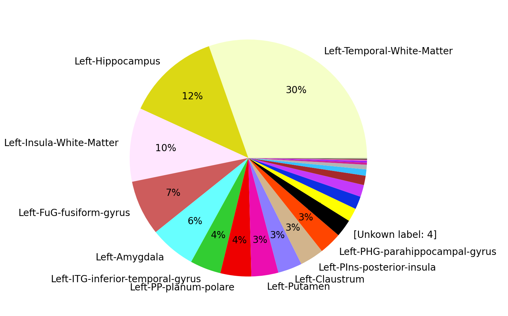

# RESSEG

Automatic segmentation of postoperative brain resection cavities from magnetic resonance images (MRI) using a convolutional neural network (CNN) trained with [PyTorch](https://pytorch.org/).

## Requirements

A GPU with 6 GB of VRAM is large enough to segment an image in an MNI space of size 193 × 229 × 193.
CPU segmentation is also possible, but it will be slower.

## Installation

```shell
pip install resseg
```

## Usage

Below are two examples of cavity segmentation for tumor and epilepsy surgery. The epilepsy example includes registration to the [MNI space](https://www.lead-dbs.org/about-the-mni-spaces/).
Both examples can be run online using Google Colab:

[](https://colab.research.google.com/github/fepegar/resseg/blob/master/RESSEG.ipynb)

### BITE

Example using an image from the
[Brain Images of Tumors for Evaluation database (BITE)](http://nist.mni.mcgill.ca/?page_id=672).

```shell
BITE=$(resseg-download bite)
resseg $BITE -o bite_seg.nii.gz
```



### EPISURG

Example using an image from the [EPISURG dataset](https://doi.org/10.5522/04/9996158.v1).
Segmentation works best when images are in the MNI space, so `resseg` includes a tool
for this purpose (requires [`antspyx`](https://antspyx.readthedocs.io/en/latest/?badge=latest)).

```shell
pip install antspyx
EPISURG=`resseg-download episurg`
resseg-mni $EPISURG -t episurg_to_mni.tfm
resseg $EPISURG -o episurg_seg.nii.gz -t episurg_to_mni.tfm
```



## Trained model

The trained model can be used without installing `resseg`, but you"ll need to install [`unet`](https://pypi.org/project/unet/) first:

```shell
pip install unet
```

Then, in Python:

```python
import torch
repo = "fepegar/resseg"
model_name = "ressegnet"
model = torch.hub.load(repo, model_name, pretrained=True, trust_repo=True)
```

## Graphical user interface using 3D Slicer

There is an experimental graphical user interface (GUI) built on top of [3D Slicer](https://www.slicer.org/).

Visit [this repository](https://github.com/fepegar/SlicerParcellation#brain-resection-cavity-segmentation) for additional information and installation instructions.


## Plotting resected structures

A quantitative analysis of the resected structures can be performed using a brain parcellation computed using [GIF](http://niftyweb.cs.ucl.ac.uk/program.php?p=GIF) (3.0) or [FreeSurfer](https://surfer.nmr.mgh.harvard.edu/fswiki/FsTutorial/AnatomicalROI).

```python
from resseg.parcellation import GIFParcellation
parcellation_path = "t1_seg_gif.nii.gz"
cavity_seg_on_preop_path = "cavity_on_preop.nii.gz"
parcellation = GIFParcellation(parcellation_path)
```

I used a sphere near the hippocampus to simulate the resection cavity segmentation, and the GIF parcellation in the [FPG dataset](https://torchio.readthedocs.io/datasets.html#fpg) of [TorchIO](https://torchio.readthedocs.io/).

```python
>>> parcellation.print_percentage_of_resected_structures(cavity_seg_on_preop_path)
Percentage of each resected structure:
100% of Left vessel
 83% of Left Inf Lat Vent
 59% of Left Amygdala
 58% of Left Hippocampus
 26% of Left PIns posterior insula
 24% of Left PP planum polare
 21% of Left Basal Forebrain
 18% of Left Claustrum
 16% of Left PHG parahippocampal gyrus
 15% of Left Pallidum
 15% of Left Ent entorhinal area
 13% of Left FuG fusiform gyrus
 13% of Left Temporal White Matter
 11% of Left Putamen
 10% of Left Insula White Matter
  5% of Left ITG inferior temporal gyrus
  5% of Left periventricular white matter
  5% of Left Ventral DC

The resection volume is composed of:
 30% is Left Temporal White Matter
 12% is Left Hippocampus
 10% is Left Insula White Matter
  7% is Left FuG fusiform gyrus
  6% is Left Amygdala
  4% is Left ITG inferior temporal gyrus
  4% is Left PP planum polare
  3% is Left Putamen
  3% is Left Claustrum
  3% is Left PIns posterior insula
  3% is Left PHG parahippocampal gyrus
  2% is [Unkown label: 4]
  1% is Left Ent entorhinal area
  1% is Left Pallidum
  1% is Left Inf Lat Vent
  1% is Left Ventral DC
```

```python
>>> parcellation.plot_bars(cavity_seg_on_preop_path)
```



```python
>>> parcellation.plot_pie(cavity_seg_on_preop_path)
```



## Credit

If you use RESSEG, please cite the following publications:

> [F. Pérez-García et al., 2020, *Simulation of Brain Resection for Cavity Segmentation Using Self-Supervised and Semi-Supervised Learning*](https://link.springer.com/chapter/10.1007%2F978-3-030-59716-0_12).

> [F. Pérez-García et al., 2021, *A self-supervised learning strategy for postoperative brain cavity segmentation simulating resections*](https://link.springer.com/article/10.1007/s11548-021-02420-2).

> [F. Pérez-García et al., 2020, *EPISURG: a dataset of postoperative magnetic resonance images (MRI) for quantitative analysis of resection neurosurgery for refractory epilepsy*. University College London. Dataset.](https://doi.org/10.5522/04/9996158.v1)

## See also

- [`resector`](https://github.com/fepegar/resector) was used to simulate brain resections during training
- [TorchIO](http://torchio.rtfd.io/) was also used extensively. Both `resseg` and `resector` require TorchIO.
